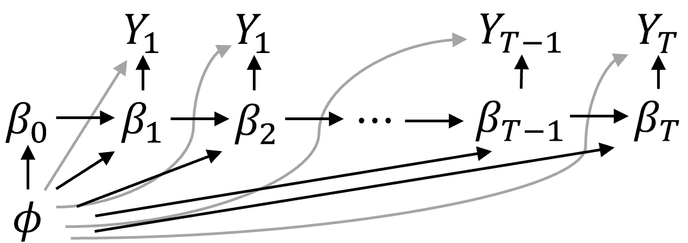

# Forward Filtering Backward Sampling - Shared Variance

This chapter discusses the Dynamic Linear Model with a scale factor for the variance shared across time and its derivations at each step. The approach taken in this chapter is borrowed from West and Harrison (1997), with some details derived from Petris et al (2009). The solution we take to estimate the parameters of this model is utilized via Forward Filtering Backward Sampling.

For full generality and to maintain a multivariate normal system in both the data and parameter matrices, we assume all $Y_{t} \in \mathbb{R}^{n}$, $\beta_{t} \in \mathbb{R}^{p}$, and $t \in \{1,\ldots,T\}$ for some integer $T$.

## Background

The model we are concerned with studying is a class of time-varying models called the Dynamic Linear Model. The setup for the equation follows:

\begin{equation*}
\begin{split}
Y_{t}\vert\beta_{t}, \sigma^{2} &\sim N(F_{t}\beta_{t}, \sigma^{2}V_{t})\\
\beta_{t}\vert \beta_{t-1},\sigma^{2} &\sim N(G_{t}\beta_{t-1}, \sigma^{2}W_{t})\\
\sigma^{-2} &\sim \Gamma(a_{t-1},b_{t-1})\\
\beta_{t-1}\vert \sigma^{2} &\sim N(m_{t-1}, \sigma^{2}C_{t-1})\\
\end{split}
(\#eq:dlmsetup)
\end{equation*}

Alternatively, using Normal-Inverse Gamma notation, where, if $\sigma^{-2} \sim \Gamma(a_{t-1},b_{t-1})$, $\sigma^{2} \sim IG(a_{t-1},b_{t-1})$, where $IG$ denotes an inverse Gamma distribution, we may write the above set of equations as the following:
\begin{equation*}
\begin{split}
Y_{t},\sigma^{2}\vert \beta_{t} &\sim NIG(F_{t}\beta_{t}, V_{t}, a_{t-1}, b_{t-1})\\
\beta_{t},\sigma^{2}\vert \beta_{t-1} &\sim NIG(G_{t}\beta_{t-1}, W_{t}, a_{t-1}, b_{t-1})\\
\beta_{t-1},\sigma^{2} &\sim NIG(m_{t-1}, C_{t-1}, a_{t-1}, b_{t-1})
\end{split}
(\#eq:dlmsetupnig)
\end{equation*}

The task is to acquire estimates for $\beta_{0,\ldots,T}$ and $\sigma^{2}$. This task may be divided into the forward filter and backwards sampling steps (collectively referred to as the Forward Filter-Backwards Sampling (FFBS) algorithm): The forward filter to acquire sequential estimates, and the backwards sampling step to retroactively "smooth" our initial estimates given estimates at the last time stamp. We are given a set of observations $Y_{t,j}$, and known parameters $F_{t}$, $G_{t}$, $V_{t}$, $W_{t}$, and $n_{t-1}$, although Frankenburg and Banerjee also apply FFBS to cases where $F_{t}$ and $G_{t}$ are not pre-specified.

{#id .class width=60% height=60%}

### A Preliminary Note

The following equations cover the forward filtering step for the set of equations for time $t$ given the parameters for the distributions at time $t-1$. Hence the equation's setup is Markovian, i.e. the state of this set of equations only depends on that of the preceding time point. Nevertheless, applications where forward filtering propagates from an initial time point $t=0$ constitute the majority of cases, and we frequently deal with cases where all the data from time $t = 0$ (no data) to $t = T$ are accounted for.

Specifically, letting $D_{t} = \{Y_{\tau}\}_{\tau=1,\ldots,t}$, we may write the set of equations in our setup as:

\begin{equation*}
\begin{split}
Y_{t},\sigma^{2}\vert \beta_{t},D_{t-1} &\sim NIG(F_{t}\beta_{t}, V_{t}, a_{t-1}, b_{t-1})\\
\beta_{t},\sigma^{2}\vert \beta_{t-1},D_{t-1} &\sim NIG(G_{t}\beta_{t-1}, W_{t}, a_{t-1}, b_{t-1})\\
\beta_{t-1},\sigma^{2}\vert D_{t-1} &\sim NIG(m_{t-1}, C_{t-1}, a_{t-1}, b_{t-1})
\end{split}
(\#eq:setupudfulldata)
\end{equation*}

We aim to derive the sequential posteriors $\beta_{t}\vert D_{t}$ and $\sigma^{2} \vert D_{t}$ respectively.

## Derivation of the Forward Filter

We proceed for some arbitrary $t$:

\begin{equation*}
\begin{split}
\beta_{t}\vert D_{t-1} &= G_{t}\beta_{t-1} + \omega_{t}, \omega_{t} \sim N(0, \sigma^{2}W_{t})\\
\beta_{t}\vert \sigma^{2}, D_{t-1} &\sim N(G_{t}m_{t-1}, \sigma^{2}(G_{t}C_{t-1}G_{t}^{\T} + W_{t}))\\
\end{split}
(\#eq:Gsetup)
\end{equation*}

Now, let $m^{*}_{t} = G_{t}m_{t-1}$ and $R_{t} = G_{t}C_{t-1}G_{t}^{\T} + W_{t}$. We then have:

\begin{equation*}
\begin{split}
Y_{t}\vert D_{t-1} &= F_{t}\beta_{t} + \nu_{t}, \nu_{t}\sim N(0, \sigma^{2}V_{t})\\
Y_{t}\vert \sigma^{2}, D_{t-1} &\sim N(F_{t}m^{*}_{t}, \sigma^{2}(F_{t}R_{t}F_{t}^{\T} + V_{t}))
\end{split}
(\#eq:Fsetup)
\end{equation*}

Since $\sigma^{2} \sim IG(a_{t-1},b_{t-1})$, we marginalize it out of $Y_{t}\vert \sigma^{2}$ to get

\begin{equation*}
Y_{t}\vert D_{t-1} \sim T_{2a_{t-1}}(F_{t}m^{*}_{t}, \frac{b_{t-1}}{a_{t-1}}(F_{t}R_{t}F_{t}^{\T} + V_{t}))
(\#eq:Ymargin)
\end{equation*}

We now have the apparatus needed to compute the sequential posterior $\beta_{t}\vert Y_{t}$ and $\sigma^{2}\vert Y_{t}$:

### Deriving $\beta_{t} \vert D_{t}$

\begin{equation*}
\begin{split}
p(\beta_{t} \vert \sigma^{2}, D_{t}) &\propto p(\beta_{t}, Y_{t}\vert \sigma^{2}, D_{t-1})\\
 &\propto p(Y_{t}\vert \beta_{t},\sigma^{2}\vert D_{t-1})p(\beta_{t}\vert \sigma^{2},  D_{t-1})\\
 &\propto \sigma^{-n}\exp\left(-\frac{1}{2\sigma^{2}}(y_{t} - F_{t}\beta_{t})^{\T}V_{t}^{-1}(y_{t} - F_{t}\beta_{t})\right)\\
 &\sigma^{-p}\exp\left(-\frac{1}{2\sigma^{2}}(\beta_{t} - m^{*}_{t})^{\T}R_{t}^{-1}(\beta_{t} - m^{*}_{t})\right)\\
 &\propto \sigma^{-(n+p)}\exp\bigl(-\frac{1}{2\sigma^{2}}[(y_{t} - F_{t}\beta_{t})^{\T}V_{t}^{-1}(y_{t} - F_{t}\beta_{t})\\
 &+ (\beta_{t} - m^{*}_{t})^{\T}R_{t}^{-1}(\beta_{t} - m^{*}_{t})]\bigr)\\
\end{split}
 (\#eq:betaud1)
\end{equation*}

Note next that
\begin{equation*}
\begin{split}
\begin{bmatrix}Y_{t}\\ \beta_{t}\end{bmatrix}\vert \sigma^{2},D_{t-1} &\sim N\left(\begin{bmatrix}F_{t}m^{*}_{t}\\ m^{*}_{t}\end{bmatrix},\sigma^{2}\begin{bmatrix}F_{t}R_{t}F_{t}^{\T} + V_{t} & F_{t}R_{t}\\
R_{t}F_{t}^{\T} & R_{t}\end{bmatrix}\right)
\end{split}
(\#eq:blocksetup)
\end{equation*}

with the cross-terms $\mathrm{Cov}(Y_{t},\beta_{t}\vert D_{t-1}) = \mathrm{Cov}(F_{t}\beta_{t} + \nu_{t},\beta_{t}\vert D_{t-1}) = F_{t}\mathrm{Cov}(\beta_{t}, \beta_{t}\vert D_{t-1}) = F_{t}R_{t}$.

Since, for the following block-normal system

\begin{equation*}
\begin{split}
\begin{bmatrix}x_{1}\\ x_{2}\end{bmatrix} &\sim N\left(\begin{bmatrix}\mu_{1}\\ \mu_{2}\end{bmatrix}, \begin{bmatrix}\Sigma_{11} & \Sigma_{12}\\
\Sigma_{21} & \Sigma_{22}\end{bmatrix}\right)
\end{split}
(\#eq:blockmateq)
\end{equation*}

we have

\begin{equation*}
x_{2}\vert x_{1} \sim N(\mu_{2} + \Sigma_{21}\Sigma_{11}^{-1}(x_{1} - \mu_{1}), \Sigma_{22} - \Sigma_{21}\Sigma_{11}^{-1}\Sigma_{12})
(\#eq:blockcondeq)
\end{equation*}

(The derivation of \@ref(eq:blockcondeq) can be found in the Appendix.)

We arrive at,

\begin{equation*}
\begin{split}
\beta_{t}\vert \sigma^{2},D_{t} &\sim N(m_{t}^{*} + R_{t}F_{t}^{\T}(F_{t}R_{t}F_{t}^{\T} + V_{t})^{-1}(Y_{t} - F_{t}m_{t}^{*}),\\
 &R_{t} - R_{t}F_{t}^{\T}(F_{t}R_{t}F_{t}^{\T} + V_{t})^{-1}F_{t}R_{t})\\
 &\sim N(m_{t}^{*} + R_{t}F_{t}^{\T}Q_{t}^{-1}(Y_{t} - F_{t}m_{t}^{*}), R_{t} - R_{t}F_{t}^{\T}Q_{t}^{-1}F_{t}R_{t})
\end{split}
(\#eq:betaud2)
\end{equation*}

where $Q_{t} = F_{t}R_{t}F_{t}^{\T} + V_{t}$.

(Note that Petris's expression for the variance suffers from a typo; to see this, simply take their $\widetilde{C}_{t}^{\T}$.)

### Deriving $\sigma^{2} \vert D_{t}$

We next deduce the density of $\sigma^{2}\vert Y_{t}$. Note before we begin that since $Y_{t}\vert D_{t-1} \sim T_{2a_{t-1}}(F_{t}m^{*}_{t}, Q_{t}) = \int NIG_{Y_{t}}(F_{t}m^{*}_{t}, Q_{t}, a_{t-1}, b_{t-1})d\sigma^{2}$, we can write $Y_{t}\vert \sigma^{2}, D_{t-1} \sim N(F_{t}m^{*}_{t}, \sigma^{2}Q_{t})$. Hence:

\begin{equation*}
\begin{split}
p(\sigma^{2}\vert D_{t}) &\propto p(Y_{t}\vert \sigma^{2}, D_{t-1})p(\sigma^{2}\vert D_{t-1})\\
 &\propto \sigma^{-n}\exp(-\frac{1}{2\sigma^{2}}(y_{t} - F_{t}m^{*}_{t})^{\T}Q_{t}^{-1}(y_{t} - F_{t}m^{*}_{t}))\sigma^{-2(a_{t-1} + 1)}\exp(-b_{t-1}\sigma^{-2})\\
 &\propto \sigma^{-2(a_{t-1} + \frac{n}{2} + 1)}\exp(-\sigma^{-2}[\frac{1}{2}(y_{t} - F_{t}m^{*}_{t})^{\T}Q_{t}^{-1}(y_{t} - F_{t}m^{*}_{t}) + b_{t-1}])
\end{split}
(\#eq:sigmaud)
\end{equation*}

We conclude that $\sigma^{-2}\vert D_{t} \sim \Gamma(a_{t},b_{t})$, where $a_{t} = a_{t-1} + \frac{n}{2}$ and $b_{t} = b_{t-1} + \frac{1}{2}(y_{t} - F_{t}m^{*}_{t})^{\T}Q_{t}^{-1}(y_{t} - F_{t}m^{*}_{t})$. Note in particular that we may write these recurrent equations in terms of $a_{0}$, $b_{0}$, so that:
\begin{equation*}
\begin{split}
a_{t} &= a_{0} + \frac{nt}{2}\\
b_{t} &= b_{0} + \frac{1}{2}\sum_{s=1}^{t}(y_{s} - F_{s}m^{*}_{s})^{\T}Q_{s}^{-1}(y_{s} - F_{s}m^{*}_{s})
\end{split}
(\#eq:sigmaparams)
\end{equation*}

This gives us the set of updating equations according to Petris Proposition 4.1.

## Derivation of the Backwards Sampling

Now that we have the parameters $\{\beta_{t},\sigma^{2}\vert D_{t}\}_{t=1,\ldots,T}$, we would like to work backwards and derive $\{\beta_{t},\sigma^{2}\vert \beta_{t+1}, D_{T}\}_{t=1,\ldots,T-1}$ to smooth our initial variable estimates:

\begin{equation*}
\begin{split}
p(\beta_{t}\vert \beta_{(t+1):T},\sigma^{2},D_{T}) &= p(\beta_{t}\vert \beta_{t+1},\sigma^{2},D_{t})\\
&= p(\beta_{t}\vert \beta_{t+1},\sigma^{2},D_{t})\\
 &= \frac{p(\beta_{t+1}\vert \beta_{t},D_{t})p(\beta_{t}\vert D_{t})}{p(\beta_{t+1}\vert D_{t})}\\
 &\propto p(\beta_{t+1}\vert \beta_{t},D_{t})p(\beta_{t}\vert D_{t})\\
 &\propto \exp\left(-\frac{1}{2\sigma^{2}}\left[(\beta_{t+1} - G_{t+1}\beta_{t})^{\T}W_{t+1}^{-1}(\beta_{t+1} - G_{t+1}\beta_{t})\right. \right.\\
 &\left. \left.+ (\beta_{t} - m_{t})^{\T}C_{t}^{-1}(\beta_{t} - m_{t})\right]\right)\\
 &\propto \exp\left(-\frac{1}{2\sigma^{2}}\left[\beta_{t+1}^{\T}W_{t+1}^{-1}\beta_{t+1} - 2\beta_{t+1}^{\T}W_{t+1}^{-1}G_{t+1}\beta_{t} +\right.\right.\\
 &\left.\left.\beta_{t}^{\T}G_{t+1}^{\T}W_{t+1}^{-1}G_{t+1}\beta_{t} +\beta_{t}^{\T}C_{t}^{-1}\beta_{t} - 2m_{t}^{\T}C_{t}^{-1}\beta_{t} + m_{t}^{\T}C_{t}^{-1}m_{t}\right]\right)\\
 &\propto \exp\left(-\frac{1}{2\sigma^{2}}\left[\beta_{t}^{\T}(G_{t+1}^{\T}W_{t+1}^{-1}G_{t+1} + C_{t}^{-1})\beta_{t}\right.\right.\\
 &\left.\left. - 2(C_{t}^{-1}m_{t} + G_{t+1}^{\T}W_{t+1}^{-1}\beta_{t+1})^{\T}\beta_{t}\right]\right)\\
 \beta_{t}\vert\beta_{t+1},\sigma^{2},D_{T} &\sim N\left((G_{t+1}^{\T}W_{t+1}^{-1}G_{t+1} + C_{t}^{-1})^{-1}(C_{t}^{-1}m_{t} + G_{t+1}^{\T}W_{t+1}^{-1}\beta_{t+1}),\right.\\
 &\left.\sigma^{-2}(G_{t+1}^{\T}W_{t+1}^{-1}G_{t+1} + C_{t}^{-1})^{-1}\right)\\
 &\sim N\left(m_{t} - C_{t}G_{t+1}^{\T}(W_{t+1} + G_{t+1}C_{t}G_{t+1}^{\T})^{-1}G_{t+1}m_{t} +\right.\\
 &\left.C_{t}G_{t+1}^{\T}W_{t+1}^{-1}\beta_{t+1}\right.\\
 &\left.- C_{t}G_{t+1}^{\T}(W_{t+1} + G_{t+1}C_{t}G_{t+1}^{\T})^{-1}G_{t+1}C_{t}G_{t+1}^{\T}W_{t+1}^{-1}\beta_{t+1},\right.\\
 &\left.C_{t} - C_{t}G_{t+1}^{\T}(W_{t+1} + G_{t+1}C_{t}G_{t+1}^{\T})^{-1}G_{t+1}C_{t}\right)\\
 &\sim N\left(m_{t} - C_{t}G_{t+1}^{\T}R_{t+1}^{-1}G_{t+1}m_{t} + C_{t}G_{t+1}^{\T}W_{t+1}^{-1}\beta_{t+1}\right.\\
 &\left. - C_{t}G_{t+1}^{\T}R_{t+1}^{-1}G_{t+1}C_{t}G_{t+1}^{\T}W_{t+1}^{-1}\beta_{t+1},\right.\\
 &\left.C_{t} - C_{t}G_{t+1}^{\T}R_{t+1}^{-1}G_{t+1}C_{t}\right)\\
\end{split}
 (\#eq:backsample1)
\end{equation*}

Notice that
\begin{equation*}
\begin{split}
C_{t}G_{t+1}^{\T}R_{t+1}^{-1}G_{t+1}C_{t}G_{t+1}^{\T}W_{t+1}^{-1}\beta_{t+1} &= C_{t}G_{t+1}^{\T}R_{t+1}^{-1}(R_{t+1} - W_{t+1})W_{t+1}^{-1}\beta_{t+1}\\
 &= C_{t}G_{t+1}^{\T}W_{t+1}^{-1}\beta_{t+1} - C_{t}G_{t+1}^{\T}R_{t+1}^{-1}\beta_{t+1}
\end{split}
 (\#eq:Rtbreakdown)
\end{equation*}

Hence,
\begin{equation*}
\begin{split}
\beta_{t}\vert\beta_{t+1},\sigma^{2},D_{T} &\sim N\left(m_{t} - C_{t}G_{t+1}^{\T}R_{t+1}^{-1}G_{t+1}m_{t} + C_{t}G_{t+1}^{\T}W_{t+1}^{-1}\beta_{t+1}\right.\\
 &\left. - C_{t}G_{t+1}^{\T}W_{t+1}^{-1}\beta_{t+1} + C_{t}G_{t+1}^{\T}R_{t+1}^{-1}\beta_{t+1},\right.\\
 &\left.C_{t} - C_{t}G_{t+1}^{\T}R_{t+1}^{-1}G_{t+1}C_{t}\right)\\
 &\sim N(m_{t} + C_{t}G_{t+1}^{\T}R_{t+1}^{-1}(\beta_{t+1} - m_{t+1}^{*}), C_{t} - C_{t}G_{t+1}^{\T}R_{t+1}^{-1}G_{t+1}C_{t})
\end{split}
 (\#eq:backsample2)
\end{equation*}

